#  <center> MATPLOTLIB </center>


```python
# Use for graphical Representation of data
```

### Line Plot


```python
import numpy as np                          # to make arrays
from matplotlib import pyplot as plt             
```


```python
x = np.arange(1,20)
x

```


    array([ 1,  2,  3,  4,  5,  6,  7,  8,  9, 10, 11, 12, 13, 14, 15, 16, 17,
           18, 19])


```python
y = x + x^2
```


```python
plt.plot(x,y)
plt.show()
```


    
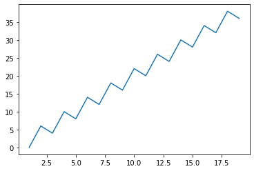
    


```python
plt.plot(x,y,color="r",linestyle="-",linewidth=3)
plt.title("MY FIRST GRAPH")
plt.xlabel("Value of X")
plt.ylabel("Value of Y")
plt.show()
```


    
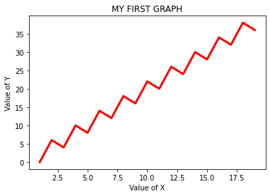
    


```python
x1 = np.arange(10,20)
x1
```


    array([10, 11, 12, 13, 14, 15, 16, 17, 18, 19])


```python
x2 = np.arange(20,30)
x2
```


    array([20, 21, 22, 23, 24, 25, 26, 27, 28, 29])


```python
y1 = x1 *x2^4
```


```python
plt.plot(x1,y1,color="r",linestyle="-",linewidth=3)
plt.plot(x1,y2,color="b",linestyle=":",linewidth=2)
plt.title("PLOTING 2 Lines")
plt.xlabel("Value of X")
plt.ylabel("Value of Y")
plt.grid(True)
plt.show()
```


    ---------------------------------------------------------------------------

    NameError                                 Traceback (most recent call last)

    <ipython-input-11-ca0a426d1a04> in <module>
          1 plt.plot(x1,y1,color="r",linestyle="-",linewidth=3)
    ----> 2 plt.plot(x1,y2,color="b",linestyle=":",linewidth=2)
          3 plt.title("PLOTING 2 Lines")
          4 plt.xlabel("Value of X")
          5 plt.ylabel("Value of Y")
    

    NameError: name 'y2' is not defined


    
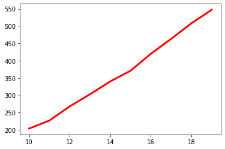
    


```python
x = np.arange(1,10)
y4 = 1+ x*2
y5 = 1+ x*2
y6 = 1+ x*2
```


```python
plt.subplot(1,2,1)                                        # Two graph at same time
plt.plot(x,y4, color='g',linestyle= ":", linewidth = 2)
plt.subplot(1,2,2)
plt.plot(x,y5, color='b',linestyle= ":", linewidth = 2)
plt.show()


```

## Bar Plot/ Graph


```python
Students = {"Yasir":90, "Bilal":70, "Sunny": 100}
```


```python
Name = list(Students.keys())
Marks = list(Students.values())
```


```python
plt.bar(Name,Marks,color="b")  
plt.title("TITLE IS")             # Bar Grapgh
plt.show()
```


    
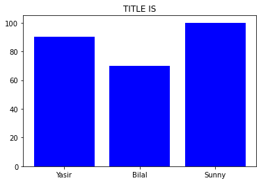
    


```python
plt.barh(Name,Marks,color="b")                  # Bar Grapgh
plt.title("BarH Grapgh")
plt.xlabel("NAMES OF STUDENT")
plt.ylabel("MARKS OF STUDENT")
plt.grid(True)
plt.show()
```


    
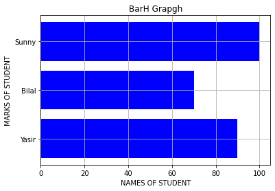
    


```python
a10 = [1,2,3,4,5]
a11=[10,11,12,13,14]                                     # Point Graph
plt.scatter(a10,a11,color = "r")

plt.show()
```


    
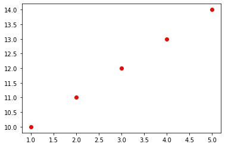
    


```python
x10 = [9,10,11,12,13]                     # 2 values in 1 Graph
a12 = [1,2,3,4,5]
a13=[10,11,12,13,14]    

plt.scatter(x10,a12)
plt.scatter(x10,a13)

plt.grid(True)
plt.show()
```


    
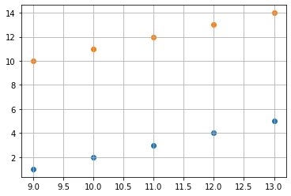
    


```python
x10 = [9,10,11,12,13]                     # 2 Graph in 1 Place
a12 = [1,2,3,4,5]
a13=[10,11,12,13,14]    

plt.subplot(1,2,1)

plt.scatter(x10,a12)
plt.title("1st SCATTER GRAPH")
plt.xlabel('Marks')
plt.ylabel('Students')
plt.grid(True)
plt.subplot(1,2,2)
plt.scatter(x10,a13,color = "r")
plt.title("2nd SCATTER GRAPH")
plt.xlabel('Marks')
plt.ylabel('Students')
plt.grid(True)

plt.show()
```


    
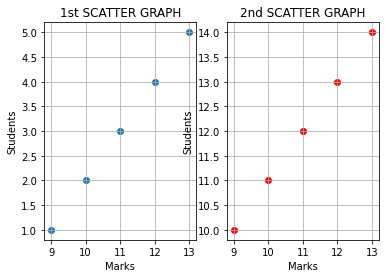
    


## HistoGram


```python
marks = [60,70,90,95,92,67,64,40]
plt.hist(marks)
plt.show
```


    <function matplotlib.pyplot.show(close=None, block=None)>


    
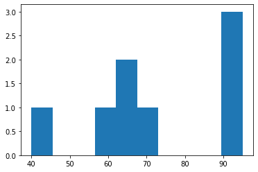
    


```python
import pandas as pd
y1 = pd.DataFrame({                                           # DO PRACITCE ALOT
    "Name":["Yasir","Bilal","Sunny"],
    "Department":["COICS","BBA","Eng"],
    "Sallary":[10000,50000,12341],
    "ProLang":["Python","None","None"]})
```


```python
plt.hist(y1["Name"],color = "r")
plt.show()
```


    
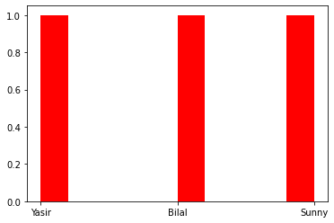
    


# BOX PLOT 


```python
one = [66,40,7,8,80,8,100]
two = [11,22,33,33,33,44,55]
three = [10,20,30,30,30,40,50]
L = list([one,two,three])
L

```


    [[66, 40, 7, 8, 80, 8, 100],
     [11, 22, 33, 33, 33, 44, 55],
     [10, 20, 30, 30, 30, 40, 50]]


```python
plt.boxplot(L)                  # Shows median of list 
plt.show()
```


    
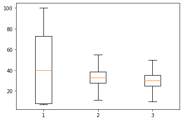
    


```python
plt.violinplot(L,showmedians=True)                  # Shows median of list 

plt.show()
```


    
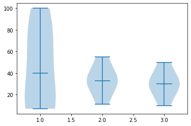
    


```python
fruits = ["Apple","Banana","Orange","Others"]
Quan = [50,20,60,100]

```


```python
plt.pie(Quan,labels = fruits)
plt.show()
```


    
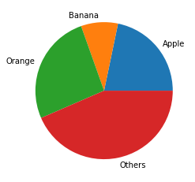
    


```python
plt.pie(Quan,labels = fruits,autopct="%0.1f%%")       # Shows Percentage also
plt.show()
```


    
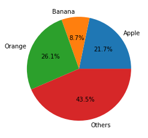
    


```python

```
